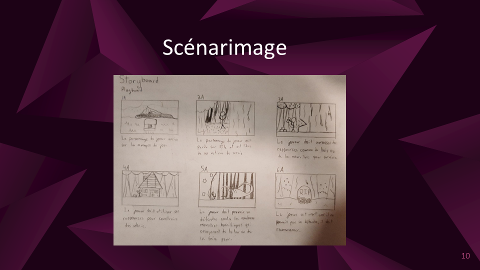
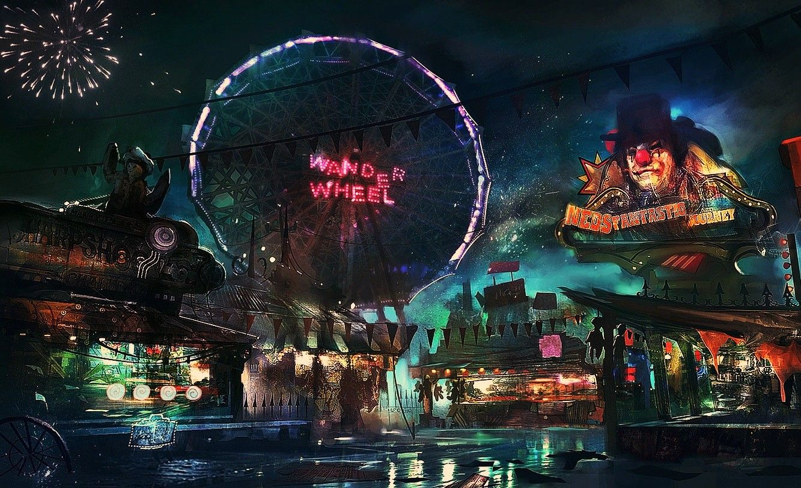
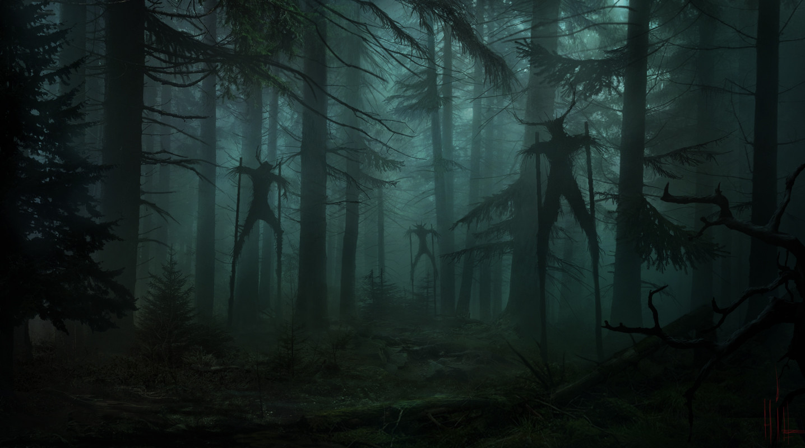
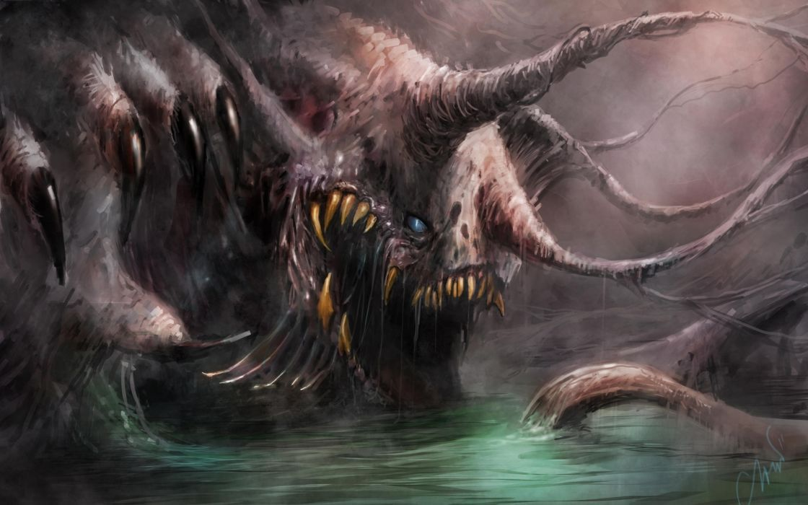

# Cours 14
## Plan de la présentation 3
Durée: 8 à 10 minutes          

### Résumer votre projet en une phrase
jeu de survie horreur sur une île hantée.         

### Description du projet 
le but conssistera a survivre et a explorer l'environnement de l'ile pour découvrir ce qu'elle cache, il sera possible de construire des batiment pour pouvoir s'habriter et il faudras bien evidement collecter des ressource pour survivre.        

### Schéma du projet ou scénarimage
             

### Moodboard
            
            
   

### Technologies
du ray-tracing

### Étapes de réalisation
Game designer
Directeur artistique
Développeur informatique
Level designer
Infographiste / graphiste multimédia
Modeleur 3d / numérique
Testeur
Sound designer
Character designer
Chef de projet
